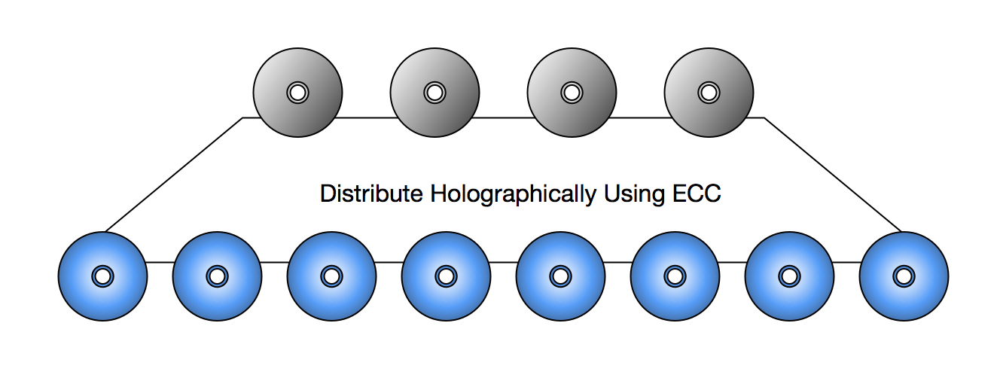

<!-- .slide: data-background="images/minidisc.jpg" -->

# LASERBOT

Decentralized Digital Preservation System

---

<!-- .slide: data-background="images/reprap.png" -->

Free and Open Optical Cold Storage Robot

Modeled after the RepRap 3D printer

---

Check out the simulator

[ROBOSIM](https://serene-goldstine-9371f9.netlify.com/)

---

<!-- .slide: data-background="images/sharding.jpg" -->

### Sharding

Using Error Correcting Codes

https://github.com/tahoe-lafs/zfec

---

Project Links

- [telegram chat](https://t.me/joinchat/EYAvshEdDkVaPlKF6q5bMA)
- [github/laserbot](https://github.com/laserbot)
- [hackmd dev notes](https://hackmd.io/hXMnMp_sSHCU1FvmhXrkWQ)

---

Grabbing Disks

---

Grabbing Disks

---

Parametric & Cheap

<iframe style="height: 50vh; width: 80%" src="https://www.youtube.com/embed/IkM2K7CsiHo" data-autoplay></iframe>

Go 2D with more rope 

---

