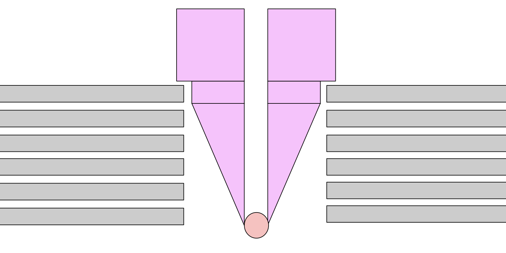
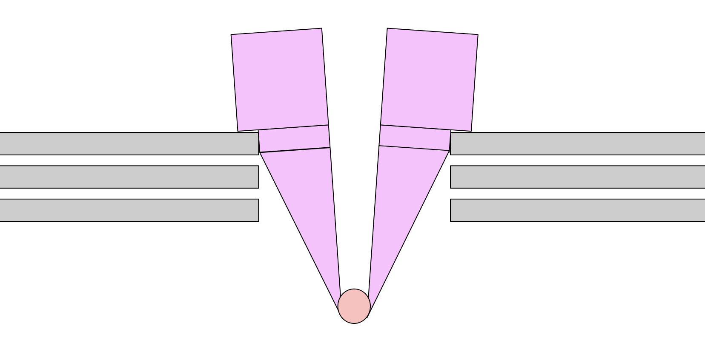

<!-- .slide: data-background="images/minidisc.jpg" -->

# LASERBOT

Decentralized Digital Preservation System

## `laserbot.net`
---

<!-- .slide: data-background="images/geocities.jpeg" -->

# Digitial Amnesia

#### Long-term archival storage

(but also: IoT, blockchains itself, etc.)

---

# Optics

- Cold storage: facebook stores 160PB at 2kW
- Also: solar flare resistant (maybe, lol)

---

<!-- .slide: data-background="images/reprap.png" -->

Free and Open Optical Cold Storage Robot

Modeled after the RepRap 3D printer

---

<!-- .slide: data-background="images/reprap.png" -->

## Gantry Crane

Cheap, off the shelf, replicable

---

<!-- .slide: data-background="images/simulator.gif" -->

### [`simulator.laserbot.net`](http://simulator.laserbot.net)

---

<!-- .slide: data-background="images/globe.png" -->

# All Teh Web

### *finders* propose URIs
### *keepers* download & burn

---

### Cryptoeconomics

- **finders** anonymously propose URIs
- by putting money into contracts specified by the **keepers**
- finders put enought money? the **keepers** download & store the resource
- specific incentives (stakes), ensure that **keepers** don't cheat their storage promises.

(WIP)

---

<!-- .slide: data-background="images/borked.jpg" -->

# Sharding?

## `tahoe-lafs/zfec`

---

<!-- .slide: data-background="images/noisebridge.jpg" -->

### `Laserbot 💖 Hackerspaces`

(subgoal: Bring crypto community & maker community together)

---

## MAIN ACHIEVEMENT

- Get project off the ground for iteration

- Get ppl interested

---

Project Links

- [telegram chat](https://t.me/joinchat/EYAvshEdDkVaPlKF6q5bMA)
- [github/laserbot](https://github.com/laserbot)
- [hackmd dev notes](https://hackmd.io/hXMnMp_sSHCU1FvmhXrkWQ)

---

Grabbing Disks

---

Grabbing Disks

---

<!-- Parametric & Cheap -->

<iframe style="height: 90vh; width: 80%" src="https://www.youtube.com/embed/IkM2K7CsiHo" data-autoplay></iframe>

<!-- Go 2D with more rope  -->
